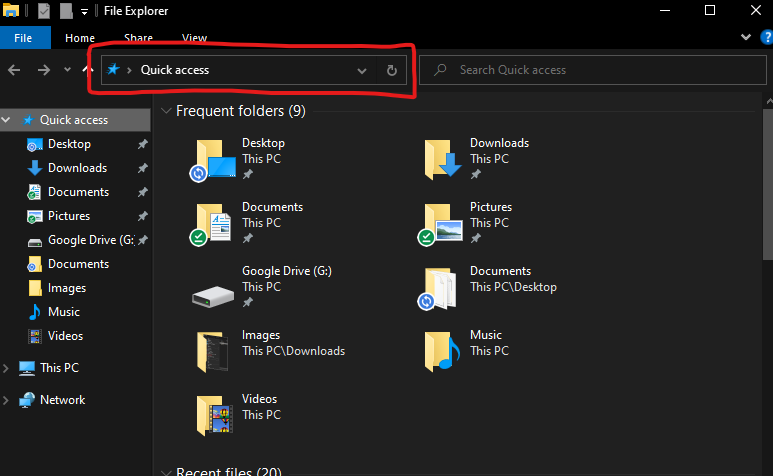
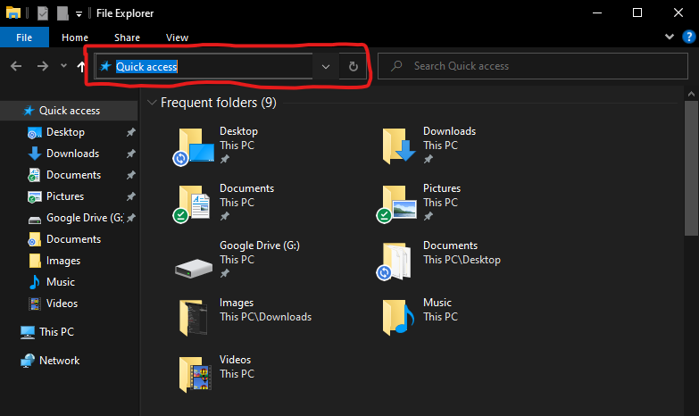
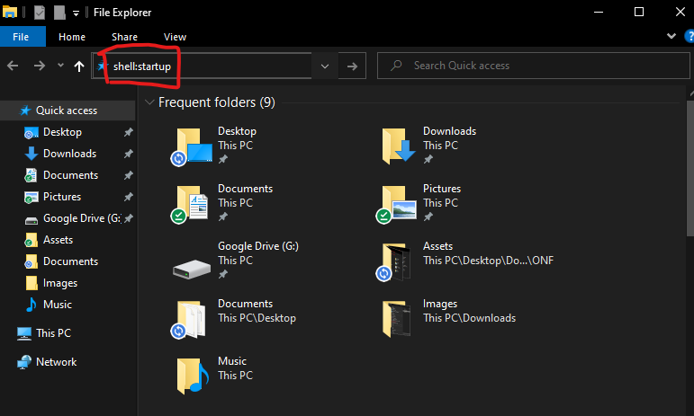

# ONF - System on and off counter

This is a small package with which you can count the number of times your computer was turned on.

### Requirements
1. [Python 3](https://www.installpython3.com)
2. Windows computer (Windows 10 is preffered)

### Installation
1. Copy the folder [ONF](./ONF)
2. Paste it in 'site-packages'
   
   To open 'site-packages'
   Run this piece of code in python
   
   ```python
   import sys, webbrowser
   for folder in sys:
      if folder.endswith('site-packages'):
          webbrowser.open(folder)
   ```

The following is only for windows computers

3. Open [onf.cmd](./Assets/onf.cmd) in a text editor
4. Open the folder 'ONF' in 'site-packages' that you just pasted
5. Copy the folder link from address bar

   
   

6. Replace `"link-to-folder-ONF"` in [onf.cmd](./Assets/onf.cmd) with the copied link
7. Copy the file [onf.cmd]
8. Open Windows Explorer (Using shortcut Win+E)
9. In the address bar, type "shell:startup" and hit enter
   
10. Paste the [onf.cmd](./Assets/onf.cmd) file you just copied

You are all set. Whenever your computer starts up, it will be counted.
To know the count, run this piece of code in python
```python
from ONF import count
print(count)
```


#### Non-Windows computers
Please refer to other sources to know about files to be opened during system startup.
After you are ok with opening "main.py" on system startup,
```python
from ONF import count
print(count)
```
works for you.